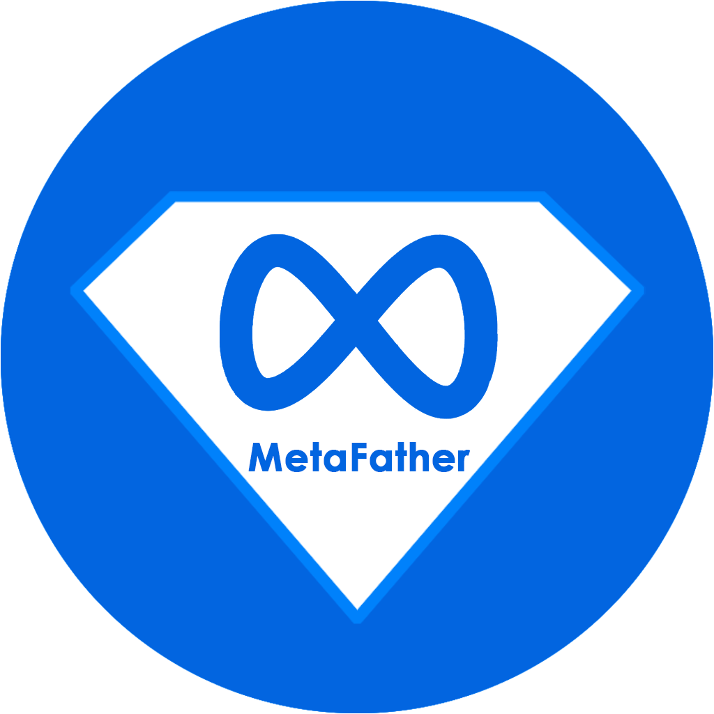
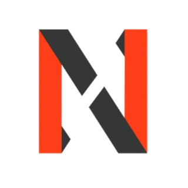
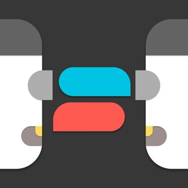

# :lucide-file-down: Sources

!!! tip "This list is non-exhaustive, feel free to add more by clicking the 'Edit this page' button!"

{align=right width=100}

## ⭐ VrSrc

Provides `rclone` servers that work with Rookie and ApprenticeVR. Currently the best source available.

See the [public JSON](public-json.md) page for details.

[:fontawesome-brands-telegram:](https://t.me/s/the_VrSrc){.card-link title="Telegram (no account needed)"}

## Non-Telegram

{align=right width=200}

### RuTracker

Large selection of Quest content available via torrents. Can be simplified with [VRSideForge](https://github.com/yGuilhermy/VRSideForge).

[:lucide-home:](https://rutracker.org/forum/index.php){.card-link title=Homepage}

### VRTor

Russian website with a lot of content available.

[:lucide-home:](https://vrtor.ru/){.card-link title=Homepage}
[:fontawesome-brands-telegram:](https://t.me/VRlite){.card-link title=Telegram}

{align=right width=100 }

### MetaFather

Large repository, but requires a Windows app to use.

[:lucide-home:](https://www.metafather.org/){.card-link title=Homepage}
[:fontawesome-brands-telegram:](https://t.me/metaversefather){.card-link title=Telegram}

{align=right width=100}

### YAOSVR

Chinese website focusing on older content.

[:lucide-home:](https://yaosvr.com/forum-127-1.html){.card-link title=Homepage}

{align=right width=100}

### BaozouVR

Chinese repository.

[:lucide-home:](https://www.baozouvr.com/){.card-link title=Homepage}

## Telegram

{align=right width=100}

### MetaQuestNexus

Spanish group focusing on specialty content.

[:fontawesome-brands-telegram:](https://t.me/MetaQuestNexus){.card-link title=Telegram}

{align=right width=100}

### NSWTL Gamehub

A torrent search engine within Telegram. Select the "VR Oculus Quest" group when joining.

[:fontawesome-brands-telegram:](https://t.me/NSW_TorrentLibrary){.card-link title=Telegram}

